# Задание 1. Архитектура маркетплейса

[Условие задачи](task-01.md)

Маркетплейс позволяет продавцам публиковать товары, а покупателям получать
персонализированную ленту, оформлять и оплачивать заказы. Об изменениях статуса
заказа пользователь получает уведомление

**Реализовано:** каркас Catalog Service на Python 3.14 / FastAPI, `GET /health`,
Dockerfile и Docker Compose. Бизнес-логики, БД и интеграций в коде нет.
Описанная ниже архитектура - целевая; остальные контейнеры на этом этапе
существуют только на диаграмме и не запускаются

## Запуск

Нужны Docker Engine с Docker Compose либо запущенный Docker Desktop, свободный
порт `8000` и доступ к интернету для первой сборки. Перед выполнением команд
перейдите из корня репозитория в папку задания:

```bash
cd tasks/01-architecture_design
```

Все дальнейшие команды выполняются из этой папки

```bash
docker compose up --build --wait
curl --fail-with-body -i http://localhost:8000/health
```

Ожидаемый ответ:

```http
HTTP/1.1 200 OK
content-type: application/json

{"status":"ok"}
```

Проверить состояние контейнера и посмотреть логи:

```bash
docker compose ps
docker compose logs catalog
```

Сервис должен иметь статус `healthy`. Docker проверяет `/health` средствами
стандартной библиотеки Python, поэтому `curl` внутри образа не нужен.
Endpoint проверяет работу HTTP-приложения; подключений к внешним системам
у этого каркаса нет

Остановка:

```bash
docker compose down
```

Для запуска без Docker нужен Python 3.14:

```bash
python3 -m venv .venv
.venv/bin/python -m pip install -r services/catalog/requirements.txt
.venv/bin/python -m uvicorn app.main:app --app-dir services/catalog --host 127.0.0.1 --port 8000
```

## Допущения и границы задачи

- Один пользователь может быть покупателем и продавцом; это роли одной учётной записи
- Один заказ содержит товары одного продавца. Мультизаказы, доставка, складские
  резервы, возвраты и выплаты продавцам остаются за рамками этого проекта
- Оплата производится в рублях через внешнего платёжного провайдера
  Суммы хранятся в целых копейках, данные банковских карт - у провайдера
- Для персонализации достаточно интересующих покупателя категорий и популярности
  товаров; машинное обучение и сбор истории просмотров не требуются
- Величина нагрузки в условии не задана. Разделение обосновано границами
  ответственности и характером операций, а не предполагаемыми миллионами запросов

## C4 Container

Диаграмма показывает целевую систему на уровне приложений и хранилищ.
Контейнер C4 - это приложение или хранилище данных; он не обязательно равен
Docker-контейнеру. Обозначения соответствуют
[описанию Container diagram в C4](https://c4model.com/diagrams/container)



[Открыть SVG в полном размере](docs/c4-container.svg)

[Исходная C4-модель - Structurizr DSL](docs/workspace.dsl)

Модель описана в [Structurizr DSL](https://docs.structurizr.com/dsl):
`person`, `softwareSystem` и `container` задают типы элементов C4, а блок `views`
задаёт представления одной модели. Это позволяет проверять структуру и связи
валидатором и получать несколько диаграмм без дублирования их описаний

В `workspace.dsl` определены два представления:

- `Context` - покупатель, продавец, маркетплейс и внешние провайдеры
- `Containers` - приложения, брокер и отдельные БД сервисов; основной вид задания

Связи контекстного уровня автоматически выводятся из связей контейнеров.
Тег `Database` задаёт форму хранилищ, `Queue` - брокера, `Asynchronous` -
пунктирные связи. Для обоих представлений включена автоматическая раскладка

Проверить DSL через Docker из папки задания:

```bash
docker run --rm \
  --mount "type=bind,source=$PWD/docs/workspace.dsl,target=/usr/local/structurizr/workspace.dsl,readonly" \
  structurizr/structurizr:2026.09.19 validate -workspace workspace.dsl
```

Для интерактивного просмотра запустите
[Structurizr local](https://docs.structurizr.com/local/quickstart):

```bash
docker run --rm -p 127.0.0.1:8080:8080 \
  --mount "type=bind,source=$PWD/docs/workspace.dsl,target=/usr/local/structurizr/workspace.dsl,readonly" \
  structurizr/structurizr:2026.09.19 local
```

Откройте `http://localhost:8080`, затем **Diagrams**. Модель редактируется
в `docs/workspace.dsl`; после изменения обновите страницу. `Ctrl+C`
останавливает просмотрщик. Его служебные файлы остаются внутри временного
контейнера

SVG выше - сохранённая иллюстрация того же контейнерного представления;
редактируемый источник - только DSL. После изменения модели выберите
`Containers` в Structurizr, экспортируйте SVG и замените `docs/c4-container.svg`

Легенда: тёмно-синий овал - роль пользователя; синий прямоугольник -
приложение или брокер маркетплейса; цилиндр - хранилище; серый блок - внешняя система.
Рамка обозначает границу маркетплейса. Стрелка показывает инициатора запроса
или направление передачи события; тип взаимодействия и протокол подписаны.
Пунктирные стрелки обозначают асинхронную передачу, сплошные - синхронные вызовы.
Ответы на синхронные запросы отдельно не показаны.
Webhook асинхронен относительно создания платежа, но сам HTTP-запрос получает
обычный синхронный ответ

## Домены, сервисы и владение данными

| Домен → сервис | Ответственность | Собственные данные |
| --- | --- | --- |
| Пользователи → **User Service** | Регистрация, аутентификация, роли покупателя/продавца, профиль и интересы | `User DB`: аккаунты, хеши паролей, роли, контакты, выбранные категории |
| Каталог → **Catalog Service** | Создание и изменение товаров продавцом, публикация, категории, текущие цены | `Catalog DB`: товары, `seller_id`, описания, категории, цены, признак публикации |
| Персонализация → **Feed Service** | Ранжирование и пагинация ленты | `Feed DB`: собственная проекция опубликованных товаров, копия интересов, счётчики покупок |
| Заказы → **Order Service** | Проверка состава, расчёт стоимости товаров, фиксация заказа, переходы статусов | `Order DB`: покупатель, продавец, позиции, снимки названий и цен, итог, история статусов, ключи идемпотентности |
| Платежи → **Payment Service** | Формирование суммы платёжного запроса из доверенной суммы заказа, взаимодействие с провайдером, учёт попыток и результатов | `Payment DB`: `order_id`, сумма и валюта, попытки, ID провайдера, статусы, ключи идемпотентности, обработанные webhook |
| Уведомления → **Notification Service** | Выбор шаблона по статусу заказа, отправка покупателю, повторные попытки | `Notification DB`: шаблоны, задания на отправку, ID события, адресат, состояние доставки, число попыток |

Каждый сервис имеет отдельную БД, своего пользователя БД и собственные миграции.
Прямой доступ к чужой БД и межсервисные SQL JOIN запрещены. `user_id`, `product_id`
и `order_id` в чужих доменах - идентификаторы, а не внешние ключи между БД.
Итог заказа является источником суммы для Payment Service; сервис платежей
не пересчитывает товары по текущему каталогу и не принимает сумму от браузера

Проекции Feed Service и снимки Order Service не дают права изменять каталог.
Изменение цены в каталоге не меняет уже созданный заказ. Лента может отставать
от каталога, поэтому при оформлении заказа цены и публикация проверяются
через Catalog Service повторно

Web Application и API Gateway не владеют доменными данными. Брокер хранит
сообщения до обработки, но источниками истины остаются БД сервисов.
Gateway маршрутизирует запросы; каждый API проверяет токен пользователя,
роль и доступ к конкретному объекту. Продавец изменяет только свои товары
и заказы, а покупатель видит только свои заказы

## Взаимодействия и основные сценарии

### Каталог и персонализированная лента

1. Продавец через Gateway изменяет товар в Catalog Service. Сервис сохраняет
   изменение и публикует `ProductChanged`, включая ID, версию, категорию,
   актуальные данные карточки и признак публикации
2. Покупатель выбирает интересующие категории в User Service. Событие
   `UserPreferencesChanged` обновляет локальную копию интересов в Feed Service
3. Feed Service получает оба типа событий и `OrderStatusChanged` через RabbitMQ.
   Событие заказа содержит позиции и `paid_at`, сохраняемое и в последующих
   статусах. Покупка учитывается один раз по `order_id`, даже если событие
   `completed` пришло раньше события `paid`
4. При запросе ленты Feed Service читает только свою БД: сначала выдаёт
   опубликованные товары интересующих категорий, внутри группы - по числу
   покупок за последние 7 дней, затем остальные товары. При равенстве использует
   дату публикации и ID для устойчивого порядка. Для гостя и нового пользователя
   работает общая лента по популярности; при отсутствии покупок - по новизне

Это простая, объяснимая персонализация без отдельной ML-инфраструктуры.
Каталог отвечает за корректность товаров, а Feed Service может независимо
менять ранжирование. Первоначальное заполнение и восстановление проекций
выполняются из снимков через внутренние API владельцев с последующим
применением событий; версия объекта защищает от перезаписи более новых данных

### Оформление и оплата

1. Покупатель передаёт в Order Service ID товаров, количество и ключ
   идемпотентности. Сервис синхронно запрашивает актуальные товары у Catalog
   Service, проверяет публикацию и одного продавца, вычисляет сумму
   `sum(цена_в_копейках × количество)`. Перед созданием покупатель подтверждает
   актуальную сумму; при её изменении требуется новое подтверждение
2. Order Service сохраняет неизменяемые снимки позиций, итог и статус
   `awaiting_payment`, публикует `OrderStatusChanged`.
   Повтор запроса с тем же ключом возвращает тот же заказ;
   другой состав с этим ключом отклоняется
3. Order Service синхронно вызывает Payment Service с ID и сохранённой суммой
   заказа. Payment Service создаёт попытку оплаты у провайдера и возвращает
   ссылку, по которой покупатель оплачивает заказ
4. Провайдер позже отправляет webhook через Gateway в Payment Service.
   Сервис проверяет подлинность уведомления, ID платежа, сумму и валюту,
   сохраняет результат и публикует `PaymentSucceeded` или `PaymentFailed`
5. Order Service получает результат асинхронно и переводит ожидающий заказ
   в `paid` либо `payment_failed`, затем публикует `OrderStatusChanged`.
   Продавец может переводить свой оплаченный заказ в `processing`, затем
   в `completed`; остальные переходы отклоняются

Расчёт состава заказа принадлежит Order Service, а расчёт суммы запроса
провайдеру и учёт денежных операций - Payment Service. В выбранной модели
комиссия покупателю не начисляется, поэтому сумма платежа равна итогу заказа.
Платёжный провайдер подключён через один сервис, его статусы не распространяются
в остальные домены напрямую

### Уведомления

Notification Service получает `OrderStatusChanged`, выбирает шаблон,
запрашивает актуальный email в User Service по ID покупателя и передаёт письмо
email-провайдеру. Контакт не передаётся во все события заказа.
Сбой отправки или временная недоступность User Service приводит к повторной
попытке; состояние заказа уже зафиксировано и от доставки письма не зависит

### Согласованность и сбои

- **Внутри сервиса** используются транзакции PostgreSQL. Данных и общей
  транзакции между БД разных сервисов нет
- **Между сервисами** допускается задержка доставки событий. Для публикации
  используется transactional outbox: изменение и событие записываются одной
  транзакцией в БД владельца, после чего фоновый обработчик отправляет событие
  в RabbitMQ с подтверждением публикации
- **Доставка как минимум один раз:** очереди подписчиков раздельные и устойчивые,
  сообщения сохраняются; подтверждение обработки отправляется после коммита.
  Потребитель атомарно сохраняет `event_id` вместе с результатом обработки.
  События содержат версию объекта; старое событие не откатывает его состояние.
  Необработанные после ограниченного числа повторов сообщения попадают в DLQ
  для разбора и повторной отправки
- **Таймаут оплаты** не означает отказ платежа. В Payment Service сохраняется
  незавершённая попытка с ключом идемпотентности провайдера; повтор использует
  тот же ключ. Фоновая сверка с API провайдера восстанавливает результат при
  потере webhook. Вызов из Order Service также повторяется по сохранённому
  заказу; недоступность Payment Service не теряет заказ
- **Повторная оплата** после подтверждённого отказа создаёт новую попытку.
  Order Service хранит ID текущей попытки и не применяет результат старой
  попытки к новой. Платёж в неизвестном состоянии сначала сверяется;
  новую попытку до этого создавать нельзя
- **Повторная отправка письма:** уникальность `(event_id, канал)` защищает
  от повторной обработки события. Для сбоя после отправки, но до записи
  результата, используется ключ идемпотентности email-провайдера, если он
  поддерживается. Иначе редкие дубликаты письма допустимы; гарантия exactly-once
  для внешней отправки не заявляется

Эти механизмы фиксируют будущие контракты. В каркасе текущего задания
они не реализованы

## Варианты декомпозиции и выбор

| Вариант | Разбиение | Плюсы | Минусы |
| --- | --- | --- | --- |
| A. Модульный монолит | Одно приложение, шесть внутренних доменных модулей, одна БД приложения | Простой запуск и отладка; локальные вызовы; транзакции между модулями без распределённых сбоев | Общий выпуск и масштабирование; тяжёлая выдача влияет на оформление; границы модулей легче нарушить общими таблицами |
| B. Три крупных сервиса | Identity: пользователи; Storefront: каталог и лента; Commerce: заказы, платежи и уведомления. У каждого своя БД | Меньше сетевых вызовов и БД; заказ и учёт платежа внутри одного сервиса; лента может читать каталог локально | Ранжирование связано с изменениями каталога; интеграции платежей и писем входят в выпуск Commerce; масштабирование уведомлений затрагивает заказы |
| **C. Шесть доменных сервисов - выбран** | User, Catalog, Feed, Order, Payment, Notification; отдельная БД у каждого | Явное владение данными; независимое развитие ленты и каталога; сбой уведомлений не блокирует заказ; платёжная интеграция изолирована | Больше развёртываемых частей; нужны брокер, outbox и дедупликация; возникают сетевые таймауты и временно несогласованные проекции |

Выбран вариант **C**. Шесть обязанностей из условия имеют разные причины
изменения: управление профилем, редактирование каталога, ранжирование,
жизненный цикл заказа, протокол провайдера платежей и каналы уведомлений.
Поэтому каждой соответствует сервис. Категории и цены оставлены в Catalog
Service, роли покупателя и продавца - в User Service: их отдельное выделение
добавило бы сетевые связи без самостоятельной ответственности

Синхронные вызовы используются там, где нужен результат для текущего действия:
проверка товара и получение ссылки оплаты. Асинхронные - для обновления ленты,
передачи результата оплаты и отправки уведомлений, где задержка допустима.
RabbitMQ выбран для очередей событий с отдельными подписчиками; длительное
хранение потока и его аналитическая обработка в требованиях отсутствуют.
PostgreSQL подходит для транзакционных данных и первоначальных проекций ленты;
отдельные поисковый движок и кеш пока не нужны

Для небольшой команды без требований к независимым сервисам вариант A был бы
дешевле в эксплуатации. Здесь вариант C выбран как целевая сервисная архитектура
учебного проекта: он явно демонстрирует границы доменов и позволяет последовательно
реализовывать их в следующих заданиях. Ограничение текущего этапа соблюдается:
запускается только один каркас, инфраструктура остальных сервисов не добавляется

## Файлы решения

Все пути ниже указаны относительно `tasks/01-architecture_design`

```text
README.md                           # архитектура, решения и инструкция запуска
docs/workspace.dsl                  # модель C4 и представления Context / Containers
docs/c4-container.svg               # готовая диаграмма
docker-compose.yml                  # запуск Catalog Service
services/catalog/
├── app/
│   ├── __init__.py
│   └── main.py                      # только GET /health
├── .dockerignore
├── Dockerfile
└── requirements.txt
task-01.md                          # условие задания
```

Образ собирается на базе официального Python, приложение запускается через
Uvicorn от непривилегированного пользователя. Зависимости отделены от кода
для кеширования слоя установки; команда запуска задана в exec-форме,
как в [инструкции FastAPI по Docker](https://fastapi.tiangolo.com/deployment/docker/)
